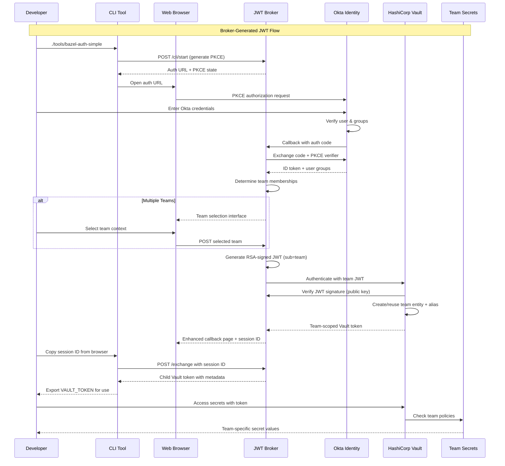

# Bazel JWT Vault Demo - Enterprise Team-Based Authentication

A demonstration of **enterprise team-based authentication** with HashiCorp Vault and Okta, implementing **broker-generated JWT tokens** for team-based secret access. Provi##  Documentation

- **[Complete Setup Guide](docs/SETUP.md)**: Step-by-step configuration instructions
- **[Architecture Documentation](docs/ARCHITECTURE.md)**: System design and JWT flow details
- **[Development Guide](docs/DEVELOPMENT.md)**: Development and troubleshooting
- **[Testing Guide](docs/TESTING.md)**: Comprehensive testing procedures

## Production Ready

This system includes enterprise features for production deployment:
- **RSA-Signed JWTs**: Secure broker-generated tokens with 2048-bit RSA key pairs
- **Team Entity Stability**: Consistent team entities eliminate access inconsistencies
- **Time-Limited Tokens**: Automatic expiration and usage limits
- **Network Integration**: Works within existing Docker network infrastructure
- **Scalable Architecture**: Stateless broker can be horizontally scaled
- **Team Context Selection**: Seamless multi-team user experience

For detailed production deployment instructions, see [docs/SETUP.md](docs/SETUP.md).tion team isolation with complete automation and stable entity management.

## What This System Provides

### **Enterprise Team-Based Authentication**
- **Okta Integration**: Single sign-on with your existing Okta identity provider using PKCE flow
- **Team Context Selection**: Multi-team users can select their working context
- **Broker-Generated JWTs**: Secure RSA-signed tokens with team subjects for stable entity management
- **Stable Team Entities**: One entity per team with consistent aliases, eliminating entity churn
- **Zero Configuration**: Developers simply login with their Okta credentials and select team context
- **Complete Automation**: OIDC flow, team selection, JWT generation, and Vault authentication all seamless

### **Security & Compliance**
- **RSA-Signed JWTs**: Broker-generated tokens with 2048-bit RSA key pairs for enhanced security
- **Team-Based Isolation**: Teams can only access their designated secrets via stable team entities
- **Stable Entity Management**: One entity per team eliminates entity churn and access inconsistencies
- **Time-Limited Tokens**: Tokens expire automatically (2h default, 4h max)
- **Limited Usage**: Tokens have restricted number of uses for security
- **Audit Trail**: All authentication events logged with team context and user metadata
- **Enterprise Standards**: OIDC compliance with secure JWT token architecture

### **Developer Experience**
- **Enhanced Callback UI**: Beautiful web interface with auto-copy functionality
- **CLI Tools**: Zero-dependency authentication tools for command-line usage
- **Bazel Integration**: Seamless wrapper for Bazel builds with automatic authentication
- **Copy-Paste Friendly**: All commands and tokens easily copyable from web interface

### **Enterprise Ready**
- **Scales with Organization**: Team model based on stable team entities, not individual management
- **Identity Integration**: Works with existing Okta directory and group structure
- **Pipeline Integration**: Designed for CI/CD pipeline authentication with team context selection
- **Network Integration**: Works within existing Docker network infrastructure
- **Entity Stability**: Teams get consistent entities with stable aliases across all authentications

## Architecture Overview

### Enterprise Team-Based Authentication Flow



### Network Architecture

```
┌─────────────────────────────────────────────────────────────┐
│                Jenkins Vault POC Network                    │
│                  (jenkins-vault-poc_default)                │
│                                                             │
│   ┌─────────────┐  ┌─────────────┐  ┌─────────────────────┐ │
│   │   Jenkins   │  │    Vault    │  │   JWT Broker        │ │
│   │ 172.18.0.3  │  │ 172.18.0.2  │  │   172.18.0.4        │ │
│   │    :8080    │  │    :8200    │  │      :8081          │ │
│   └─────────────┘  └─────────────┘  └─────────────────────┘ │
│                             │                 │             │
│                    ┌─────────────────┐        │             │
│                    │ Okta Identity   │        │             │
│                    │ (External OIDC) │        │             │
│                    └─────────────────┘        │             │
│                                               │             │
│                     ┌─────────────────────────┐             │
│                     │ RSA Key Pair            │             │
│                     │ (JWT Signing)           │             │
│                     └─────────────────────────┘             │
└─────────────────────────────────────────────────────────────┘
```

##  Quick Start

### Prerequisites
- Docker Desktop running
- Okta developer account (free at https://developer.okta.com)

### 1. Setup
```bash
# Clone and configure
git clone https://github.com/trenner1/bazel-jwt-vault-demo.git
cd bazel-jwt-vault-demo
cp broker/.env.example broker/.env
# Edit broker/.env with your Okta details (see docs/SETUP.md for details)
```

### 2. Run
```bash
# Start services
docker-compose up -d

# Test authentication
./tools/bazel-auth-simple
```

📖 **For complete setup instructions**, see [docs/SETUP.md](docs/SETUP.md)

## Authentication Flow

### Web Browser (Enhanced UX)
1. Navigate to `http://localhost:8081`
2. Login with Okta (PKCE flow)
3. Select team context (if multiple teams)
4. Auto-copy session ID from enhanced callback
5. Exchange for team-scoped Vault tokens

### CLI Tools (Zero Dependencies)
```bash
./tools/bazel-auth-simple  # Recommended - no dependencies
./tools/bazel-auth         # Python-based with advanced features  
./tools/bazel-build        # Bazel wrapper with auto-auth
```

| Tool | Purpose | Dependencies | Usage |
|------|---------|--------------|-------|
| `bazel-auth-simple` | Zero-dependency authentication | curl only | Primary CLI tool |
| `bazel-auth` | Full-featured authentication | Python + requests | Advanced features |
| `bazel-build` | Bazel wrapper with auth | bash + curl | Seamless builds |

### Tool Comparison

**`./tools/bazel-auth-simple`** (Recommended)
-  Zero dependencies (only needs `curl`)
-  Works on any system
-  Auto-opens browser
-  Clear command output
-  Environment variable export

**`./tools/bazel-build`**
-  Seamless Bazel integration
-  Automatic token refresh
-  Pipeline-friendly
-  Smart caching

## Authentication Flow Details

### Example Token Exchange

```bash
# After Okta authentication, exchange session for Vault token
curl -X POST "http://localhost:8081/exchange" \
  -H "Content-Type: application/json" \
  -d '{
    "session_id": "session_abc123...",
    "pipeline": "my-build-pipeline",
    "repo": "my-repository",
    "target": "my-build-target"
  }'

# Response includes team-scoped Vault token
{
  "token": "hvs.CAESIJ...",
  "ttl": 7200,
  "uses_remaining": 10,
  "policies": ["bazel-base", "bazel-mobile-team"],
  "metadata": {
    "team": "mobile-team",
    "user": "developer@company.com",
    "name": "John Developer",
    "pipeline": "my-build-pipeline"
  }
}
```

##  Team-Based Access Control

### Team Selection and Entity Management

Teams are automatically assigned based on Okta group membership. Users with multiple team memberships can select their working context:

| Okta Group | Vault Role | Secret Access | Entity Management |
|------------|------------|---------------|-------------------|
| `mobile-developers` | `mobile-team` | `kv/dev/mobile/*` | Stable "mobile-team" entity |
| `backend-developers` | `backend-team` | `kv/dev/backend/*` | Stable "backend-team" entity |
| `frontend-developers` | `frontend-team` | `kv/dev/frontend/*` | Stable "frontend-team" entity |
| `devops-team` | `devops-team` | All team secrets | Stable "devops-team" entity |

### Team Entity Benefits

- **Stable Aliases**: Each team gets one consistent entity (e.g., "mobile-team")
- **No Entity Churn**: Repeated authentications reuse the same team entity
- **Shared Access**: All team members share the same entity for consistent permissions
- **Metadata Alignment**: Entity aliases perfectly match vault role metadata

##  Testing

```bash
# Run all tests with interactive menu
./tests/run-tests.sh

# Test specific components
./tests/integration/test-okta-auth.sh      # OIDC authentication  
./tests/integration/test-cli-tools.sh      # CLI tools validation
./tests/integration/test-team-isolation.sh # Team access control
```

##  Documentation

- **[Complete Setup Guide](docs/SETUP.md)**: Step-by-step configuration instructions
- **[Architecture Documentation](docs/ARCHITECTURE.md)**: System design and OIDC flow details
- **[Development Guide](docs/DEVELOPMENT.md)**: Development and troubleshooting
- **[Testing Guide](docs/TESTING.md)**: Comprehensive testing procedures

##  Production Ready

This system includes enterprise features for production deployment:
- **PKCE Security**: Authorization Code Flow with Proof Key for Code Exchange
- **Real User Identity**: Audit trails with actual user emails and team metadata
- **Time-Limited Tokens**: Automatic expiration and usage limits
- **Network Integration**: Works within existing Docker network infrastructure
- **Scalable Architecture**: Stateless broker can be horizontally scaled

For detailed production deployment instructions, see [docs/SETUP.md](docs/SETUP.md).
- **Monitoring**: Implement health checks and monitoring for all components

##  Troubleshooting

### Common Issues

1. **Okta Configuration**: Verify redirect URIs, client credentials, and group claims
2. **Network Connectivity**: Ensure broker can reach both Okta and Vault
3. **Group Membership**: Verify users are assigned to correct Okta groups
4. **Token Expiration**: Check token TTLs and refresh flows

### Debug Commands

```bash
# Check broker health
curl http://localhost:8081/health

# Check Vault JWT configuration
vault auth list
vault read auth/jwt/config

# Test Okta connectivity (via broker)
curl -s "https://${OKTA_DOMAIN}/.well-known/openid_configuration"

# Verify team entities
vault list identity/entity/id
vault list identity/entity-alias/id
```

##  Enterprise Benefits

### Compared to Direct OIDC Approach

| Feature | Direct OIDC | Broker-Generated JWT |
|---------|-------------|---------------------|
| **Entity Management** | Individual user entities | Stable team entities |
| **Entity Churn** | New entities per auth | Consistent entity reuse |
| **Team Isolation** | User-based permissions | Team-based entity sharing |
| **Multi-Team Users** | Complex group mappings | Clean team context selection |
| **Token Source** | External OIDC provider | Broker-controlled JWTs |
| **Alias Stability** | User-dependent aliases | Predictable team aliases |
| **Scaling** | Entities scale with users | Entities scale with teams |

### Key Advantages

 **Stable Team Entities**: Consistent "mobile-team", "devops-team" entities with stable aliases  
 **No Entity Churn**: Same entity reused across team authentications  
 **Team Context Selection**: Clean interface for multi-team users  
 **Predictable Access**: Team-based permissions with stable entity management  
 **Enterprise Integration**: Works with existing Okta directory structure  
 **RSA Security**: Broker-controlled JWT signing with secure key management  

##  Repository Structure

```
bazel-jwt-vault-demo/
├── README.md                    # This file (updated for OIDC)
├── docker-compose.yml          # OIDC-enabled services
├── Dockerfile                  # Broker container
├── .env                        # Okta OIDC configuration
├── .env.example               # Configuration template
├── .gitignore                 # Git ignore patterns
├── MODULE.bazel               # Bazel configuration
│
├── broker/                    # JWT broker implementation
│   ├── app.py                # Team-based JWT broker with OIDC integration
│   ├── gen_keys.py           # RSA key pair generation
│   ├── jwt_signing_key       # RSA private key (generated)
│   ├── jwt_signing_key.pub   # RSA public key (generated)
│   ├── jwks.json            # JSON Web Key Set endpoint
│   ├── signer_keys.json     # Key metadata for JWT signing
│   ├── requirements.txt      # Python dependencies
│   └── start.py              # Broker startup script
│
├── vault/                     # Vault JWT configuration
│   └── setup.sh              # Vault setup for broker-based JWT auth
│
├── tests/                     # Test suites (NEW)
│   ├── run-tests.sh          # Test runner menu
│   ├── integration/          # Integration tests
│   │   ├── test-okta-auth.sh        # OIDC authentication test
│   │   ├── test-team-isolation.sh   # Team access control test
│   │   ├── test-user-identity.sh    # User identity test
│   │   └── test-full-workflow.sh    # Comprehensive test suite
│   └── scripts/              # Test utilities
│       └── verify-team-entities.sh
│
├── scripts/                   # Utility scripts
│   ├── start-broker.sh       # Broker startup (updated for JWT generation)
│   └── docker-setup.sh       # Docker environment setup
│
└── docs/                      # Documentation
    ├── ARCHITECTURE.md        # System architecture
    ├── DEVELOPMENT.md         # Development guide
    ├── SETUP.md              # Complete setup guide
    └── TESTING.md            # Testing procedures
```

##  License

MIT License - see LICENSE file for details.

##  Contributing

1. Fork the repository
2. Create a feature branch
3. Make your changes
4. Add tests for new functionality
5. Submit a pull request

##  Support

- **Issues**: [GitHub Issues](https://github.com/trenner1/bazel-jwt-vault-demo/issues)
- **Documentation**: Check the `docs/` directory
- **Testing**: Use the comprehensive test suite in `tests/`

---

*Built with ❤ for enterprise teams who want secure, automated, team-based authentication with stable entity management.*