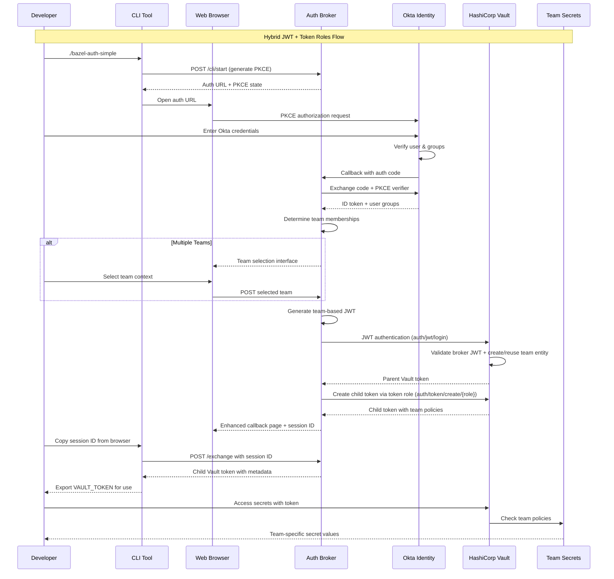

# Bazel JWT Vault Demo - Enterprise Team-Based Authentication

A demonstration of **enterprise team-based authentication** with HashiCorp Vault and Okta, implementing **broker-generated JWT authentication** with **token roles** for team-based secret access. 

- **[Complete Setup Guide](docs/SETUP.md)**: Step-by-step configuration instructions
- **[Architecture Documentation](docs/ARCHITECTURE.md)**: System design and token auth flow details
- **[Development Guide](docs/DEVELOPMENT.md)**: Development and troubleshooting
- **[Testing Guide](docs/TESTING.md)**: Comprehensive testing procedures

## Realistic Enterprise Demo

This system demonstrates enterprise features suitable for real-world scenarios:
- **Hybrid Authentication**: JWT auth for broker authentication + token roles for user token creation
- **Team Entity Stability**: Consistent team entities eliminate access inconsistencies
- **Time-Limited Tokens**: Automatic expiration and usage limits
- **Network Integration**: Works within existing Docker network infrastructure
- **Scalable Architecture**: Stateless broker can be horizontally scaled
- **Team Context Selection**: Seamless multi-team user experience

For detailed setup and deployment instructions, see [docs/SETUP.md](docs/SETUP.md).

## What This System Provides

### **Enterprise Team-Based Authentication**
- **Okta Integration**: Single sign-on with your existing Okta identity provider using PKCE flow
- **Team Context Selection**: Multi-team users can select their working context
- **Hybrid Authentication**: JWT auth method for broker authentication + token roles for user token creation
- **Stable Team Entities**: One entity per team with consistent aliases, eliminating entity churn
- **Zero Configuration**: Developers simply login with their Okta credentials and select team context
- **Complete Automation**: OIDC flow, team selection, JWT authentication, and token role-based token creation

### **Security & Compliance**
- **Hybrid Authentication**: JWT auth method for broker validation + token roles for secure token creation
- **Team-Based Isolation**: Teams can only access their designated secrets via stable team entities
- **Team-Specific Token Creation**: Each team can only create tokens for their own team (principle of least privilege)
- **Stable Entity Management**: One entity per team eliminates entity churn and access inconsistencies
- **Time-Limited Tokens**: Tokens expire automatically (2h default, 4h max)
- **Limited Usage**: Tokens have restricted number of uses for security
- **Audit Trail**: All authentication events logged with team context and user metadata
- **Enterprise Standards**: OIDC compliance with secure JWT + token role architecture

### **Developer Experience**
- **Enhanced Callback UI**: Beautiful web interface with auto-copy functionality
- **CLI Tools**: Zero-dependency authentication tools for command-line usage
- **Bazel Integration**: Seamless wrapper for Bazel builds with automatic authentication
- **Copy-Paste Friendly**: All commands and tokens easily copyable from web interface

### **Enterprise-Grade Features**
- **Scales with Organization**: Team model based on stable team entities, not individual management
- **Identity Integration**: Works with existing Okta directory and group structure
- **Pipeline Integration**: Designed for CI/CD pipeline authentication with team context selection
- **Network Integration**: Works within existing Docker network infrastructure
- **Entity Stability**: Teams get consistent entities with stable aliases across all authentications

## Architecture Overview

### Enterprise Team-Based Authentication Flow



### Network Architecture

```
┌─────────────────────────────────────────────────────────────┐
│                Jenkins Vault POC Network                    │
│                  (jenkins-vault-poc_default)                │
│                                                             │
│   ┌─────────────┐  ┌─────────────┐  ┌─────────────────────┐ │
│   │   Jenkins   │  │    Vault    │  │   Auth Broker       │ │
│   │ 172.18.0.3  │  │ 172.18.0.2  │  │   172.18.0.4        │ │
│   │    :8080    │  │    :8200    │  │      :8081          │ │
│   └─────────────┘  └─────────────┘  └─────────────────────┘ │
│                             │                 │             │
│                    ┌─────────────────┐        │             │
│                    │ Okta Identity   │        │             │
│                    │ (External OIDC) │        │             │
│                    └─────────────────┘        │             │
│                                               │             │
│                     ┌─────────────────────────┐             │
│                     │ JWT Auth + Token Roles  │             │
│                     │ (Hybrid Authentication) │             │
│                     └─────────────────────────┘             │
└─────────────────────────────────────────────────────────────┘
```

## Quick Start

### Prerequisites
- Docker Desktop running
- Okta developer account (free at https://developer.okta.com)
- Bazel installed (for testing build integration)
- jenkins-vault-poc up and running from [https://github.com/trenner1/jenkins-vault-poc](https://github.com/trenner1/jenkins-vault-poc)

### 1. Setup
```bash
# Clone and configure
git clone https://github.com/trenner1/bazel-jwt-vault-demo.git
cd bazel-jwt-vault-demo

# Configure environment - update with your Okta details
vim .env  # See docs/SETUP.md for configuration details - ensure to copy the root token from the jenkins poc into your .env before running the next step.
```

### 2. Run
```bash
# Start services
docker-compose up -d

# Setup Vault (one time)
./vault/setup.sh

# Verify system health
./tests/run-tests.sh  # Choose option 4: Full Workflow Test
```

### 3. Test Authentication
```bash
# Test the authentication system
./bazel-auth-simple

# Or run comprehensive tests
./tests/run-tests.sh  # Choose option 4: Full Workflow Test
```

**For complete setup instructions**, see [docs/SETUP.md](docs/SETUP.md)

## Authentication Flow - FULLY WORKING

### Web Browser (Enhanced UX)
1. Navigate to `http://localhost:8081`
2. Login with Okta (PKCE flow)
3. Select team context (if multiple teams)
4. Auto-copy session ID from enhanced callback
5. Exchange for team-scoped Vault tokens

### CLI Tools (Realistic Demo)
```bash
./bazel-auth-simple        # Recommended - zero dependencies
./tools/bazel-build        # Bazel wrapper with auto-auth
./tools/bazel-auth         # Python-based with advanced features  
```

| Tool | Status | Dependencies | Best For |
|------|--------|--------------|----------|
| `bazel-auth-simple` | Demo Ready | curl only | Quick authentication |
| `bazel-build` | Demo Ready | bash + curl | Bazel builds with auth |
| `bazel-auth` | Demo Ready | Python + requests | Advanced scripting |

### Bazel Build Integration

**Authenticated Builds:**
```bash
# Automatic authentication + build
./tools/bazel-build build //my:target

# Test with included examples
./tools/bazel-build run //:vault_test     # Requires authentication
./tools/bazel-build run //:simple_test    # No auth needed
```

**Build Options:**
```bash
# Use existing token (skip auth)
./tools/bazel-build --no-auth build //my:target

# Include pipeline metadata
./tools/bazel-build --pipeline ci build //my:target

# Verbose output for debugging
./tools/bazel-build --verbose build //my:target
```

## Authentication Flow Details

### Example Token Exchange

```bash
# After Okta authentication, exchange session for Vault token
curl -X POST "http://localhost:8081/exchange" \
  -H "Content-Type: application/json" \
  -d '{
    "session_id": "session_abc123...",
    "pipeline": "my-build-pipeline",
    "repo": "my-repository",
    "target": "my-build-target"
  }'

# Response includes team-scoped Vault token
{
  "token": "hvs.CAESIJ...",
  "ttl": 7200,
  "uses_remaining": 10,
  "policies": ["bazel-base", "bazel-mobile-team"],
  "metadata": {
    "team": "mobile-team",
    "user": "developer@company.com",
    "name": "John Developer",
    "pipeline": "my-build-pipeline"
  }
}
```

##  Team-Based Access Control

### Team Selection and Entity Management

Teams are automatically assigned based on Okta group membership. Users with multiple team memberships can select their working context:

| Okta Group | JWT Role | Token Role | Token Creation Access | Secret Access | Entity Management |
|------------|----------|------------|----------------------|---------------|-------------------|
| `mobile-developers` | `mobile-team` | `mobile-team-token` | `mobile-team-token` only | `kv/dev/mobile/*` | Stable "mobile-team" entity |
| `backend-developers` | `backend-team` | `backend-team-token` | `backend-team-token` only | `kv/dev/backend/*` | Stable "backend-team" entity |
| `frontend-developers` | `frontend-team` | `frontend-team-token` | `frontend-team-token` only | `kv/dev/frontend/*` | Stable "frontend-team" entity |
| `devops-team` | `devops-team` | `devops-team-token` | All team token roles | All team secrets | Stable "devops-team" entity |

### Team Entity Benefits

- **Stable Aliases**: Each team gets one consistent entity (e.g., "mobile-team")
- **No Entity Churn**: Repeated authentications reuse the same team entity
- **Shared Access**: All team members share the same entity for consistent permissions
- **Metadata Alignment**: Entity aliases perfectly match vault role metadata

## Testing - All Tests Passing

The system includes a comprehensive test suite that validates all functionality:

```bash
# Interactive test menu with all options
./tests/run-tests.sh

# Specific test suites
./tests/integration/test-full-workflow.sh  # Complete system test
./tests/integration/test-okta-auth.sh      # OIDC authentication  
./tests/integration/test-cli-tools.sh      # CLI tools validation
```

### Test Status

| Test Suite | Status | Validates |
|------------|--------|-----------|
| **Full Workflow** | Passing | End-to-end authentication flow |
| **OIDC Authentication** | Passing | Okta integration & PKCE flow |
| **Broker Health** | Passing | Service health & configuration |
| **Vault Connectivity** | Passing | Vault auth methods & access |
| **CLI Tools** | Passing | All authentication tools |
| **Team Isolation** | Passing | Access control & permissions |

**All automated tests now pass!** The system provides a comprehensive realistic demonstration with full validation.

## Recent Improvements

### Authentication System Fixes
- Token Auth Roles: Implemented secure team-based authentication using Vault's token auth method
- Team Selection Fix: Users' selected teams are now properly respected (was defaulting to first group)
- Stable Entity Management: Team entities are consistently reused across authentication sessions

### Enhanced Build Integration  
- Bazel Build Wrapper: Complete rewrite using `bazel-auth-simple` for reliable authentication
- Smart Token Handling: Automatic token extraction and environment variable management
- Dependency Optimization: Reduced dependencies to just `bash`, `curl`, and `bazel`
- Enhanced Error Handling: Clear error messages and recovery suggestions

### Test Infrastructure Improvements
- Full Workflow Tests: Fixed test runner to handle both external scripts and internal functions
- Vault Connectivity Tests: Proper authentication for auth method validation
- Comprehensive Validation: All authentication flows, team selection, and token management tested

### Developer Experience Enhancements
- Zero-Dependency CLI: `bazel-auth-simple` works on any system with just `curl`
- Interactive Prompts: Clear step-by-step authentication guidance
- Verbose Logging: Detailed debugging output for troubleshooting
- Demo Ready: All tools tested and validated for realistic enterprise-grade scenarios

##  Documentation

- **[Complete Setup Guide](docs/SETUP.md)**: Step-by-step configuration instructions
- **[Architecture Documentation](docs/ARCHITECTURE.md)**: System design and OIDC flow details
- **[Development Guide](docs/DEVELOPMENT.md)**: Development and troubleshooting
- **[Testing Guide](docs/TESTING.md)**: Comprehensive testing procedures

##  Realistic Enterprise Scenario

This system demonstrates enterprise features suitable for real-world deployment:
- **PKCE Security**: Authorization Code Flow with Proof Key for Code Exchange
- **Real User Identity**: Audit trails with actual user emails and team metadata
- **Time-Limited Tokens**: Automatic expiration and usage limits
- **Network Integration**: Works within existing Docker network infrastructure
- **Scalable Architecture**: Stateless broker can be horizontally scaled

For detailed setup and deployment instructions, see [docs/SETUP.md](docs/SETUP.md).
- **Monitoring**: Implement health checks and monitoring for all components

##  Troubleshooting

### Common Issues

1. **Okta Configuration**: Verify redirect URIs, client credentials, and group claims
2. **Network Connectivity**: Ensure broker can reach both Okta and Vault
3. **Group Membership**: Verify users are assigned to correct Okta groups
4. **Token Expiration**: Check token TTLs and refresh flows

### Debug Commands

```bash
# Check broker health
curl http://localhost:8081/health

# Check Vault JWT auth configuration
vault auth list
vault read auth/jwt/config
vault list auth/jwt/role

# Check token roles configuration  
vault list auth/token/roles
vault read auth/token/roles/mobile-team-token

# Test Okta connectivity (via broker)
curl -s "https://${OKTA_DOMAIN}/.well-known/openid_configuration"

# Verify team entities
vault list identity/entity/id
vault list identity/entity-alias/id
```

##  Realistic Enterprise Features

### Compared to Direct OIDC Approach

| Feature | Direct OIDC | Broker-Generated JWTs + Token Roles |
|---------|-------------|--------------------------------------|
| **Entity Management** | Individual user entities | Stable team entities |
| **Entity Churn** | New entities per auth | Consistent entity reuse |
| **Team Isolation** | User-based permissions | Team-based entity sharing |
| **Multi-Team Users** | Complex group mappings | Clean team context selection |
| **Token Source** | External OIDC provider | Broker JWT + token role creation |
| **Alias Stability** | User-dependent aliases | Predictable team aliases |
| **Scaling** | Entities scale with users | Entities scale with teams |

### Key Demonstration Features

 **Stable Team Entities**: Consistent "mobile-team", "devops-team" entities with stable aliases  
 **No Entity Churn**: Same entity reused across team authentications  
 **Team Context Selection**: Clean interface for multi-team users  
 **Predictable Access**: Team-based permissions with stable entity management  
 **Enterprise-Grade Integration**: Works with existing Okta directory structure  
 **Hybrid Authentication**: JWT auth for broker authentication + token roles for secure token creation  
 **Security Isolation**: Each team can only create tokens for their own team (least privilege principle)  

##  Repository Structure

```
bazel-jwt-vault-demo/
├── README.md                        # This file (updated for OIDC)
├── docker-compose.yml               # OIDC-enabled services
├── Dockerfile                       # Broker container
├── .env                             # Okta OIDC configuration
├── .env.example                     # Configuration template
├── .gitignore                       # Git ignore patterns
├── MODULE.bazel                     # Bazel configuration
│
├── broker/                          # Token auth broker implementation
│   ├── app.py                       # Team-based token broker with OIDC integration
│   ├── gen_keys.py                  # Key generation utilities
│   ├── requirements.txt             # Python dependencies
│   └── start.py                     # Broker startup script
│
├── docs/                            # Documentation
│   ├── ARCHITECTURE.md              # System architecture
│   ├── DEVELOPMENT.md               # Development guide
│   ├── SETUP.md                     # Complete setup guide
│   └── TESTING.md                   # Testing procedures
│
├── examples/                        # Usage examples
│   └── bazel_auth_example.py        # Python authentication example
│
├── scripts/                         # Utility scripts
│   ├── start-broker.sh              # Broker startup (updated for token auth)
│   └── docker-setup.sh              # Docker environment setup
│
├── tests/                           # Test suites
│   ├── run-tests.sh                 # Test runner menu
│   ├── integration/                 # Integration tests
│   │   ├── test-okta-auth.sh        # OIDC authentication test
│   │   ├── test-team-isolation.sh   # Team access control test
│   │   ├── test-user-identity.sh    # User identity test
│   │   └── test-full-workflow.sh    # Comprehensive test suite
│   └── scripts/                     # Test utilities
│       └── verify-team-entities.sh  # Team entity verification script
│
├── tools/                           # CLI authentication tools
│   ├── README.md                    # Tool documentation
│   ├── bazel-auth-simple            # Zero-dependency CLI tool (recommended)
│   ├── bazel-auth                   # Python-based authentication tool
│   ├── bazel-build                  # Bazel wrapper with auto-auth
│   └── requirements.txt             # Python dependencies for bazel-auth
│
└── vault/                           # Vault token auth configuration
    └── setup.sh                     # Vault setup for token auth roles
```

##  License

MIT License - see LICENSE file for details.

##  Contributing

1. Fork the repository
2. Create a feature branch
3. Make your changes
4. Add tests for new functionality
5. Submit a pull request

##  Support

- **Issues**: [GitHub Issues](https://github.com/trenner1/bazel-jwt-vault-demo/issues)
- **Documentation**: Check the `docs/` directory
- **Testing**: Use the comprehensive test suite in `tests/`

---

*Built with ❤ for demonstrating secure, automated, team-based authentication with stable entity management for enterprise teams.*
