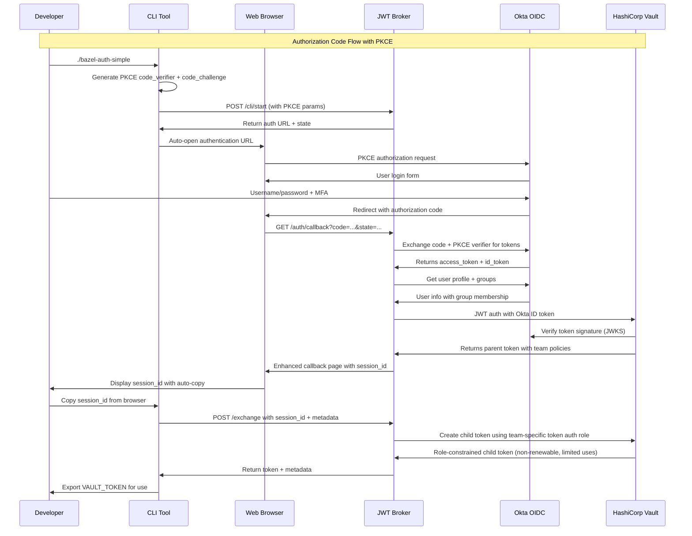

# System Architecture

This document describes the system architecture of the Enterprise OIDC Vault Demo, detailing how Okta, the broker service, and HashiCorp Vault work together to provide secure, team-based secret management.

## Table of Contents

- [Overview](#overview)
- [Component Architecture](#component-architecture)
- [Authentication Flow](#authentication-flow)
- [Team-Based Access Model](#team-based-access-model)
- [CLI Tools Architecture](#cli-tools-architecture)
- [Data Flow Diagrams](#data-flow-diagrams)
- [Security Architecture](#security-architecture)
- [Deployment Architecture](#deployment-architecture)
- [Performance Characteristics](#performance-characteristics)
- [Integration Points](#integration-points)
- [References](#references)

## Overview

The system implements an enterprise-grade authentication architecture using:

- **Okta OIDC**: Enterprise identity provider with Authorization Code Flow + PKCE
- **JWT Broker**: Intermediary service for PKCE token exchange and session management
- **HashiCorp Vault**: Secret management with JWT auth method and team-based policies
- **CLI Tools**: Zero-dependency authentication tools for developer workflows
- **Docker Compose**: Containerized deployment with network isolation

### Key Architectural Principles

1. **Zero Trust Security**: PKCE flow prevents code interception attacks
2. **Enterprise Integration**: Leverages existing Okta identity infrastructure
3. **Team-Based Authorization**: Automatic access control via Okta groups → Vault roles
4. **Developer Experience**: Enhanced callback UI with auto-copy functionality
5. **CLI-First Design**: Zero-dependency tools for command-line workflows
6. **Audit Transparency**: Complete audit trail with real user identity
7. **Scalable Design**: Supports growing teams and environments

## Component Architecture

```
┌─────────────────────────────────────────────────────────────────┐
│                        Enterprise Network                       │
├─────────────────────────────────────────────────────────────────┤
│                                                                 │
│  ┌──────────────┐    ┌──────────────┐    ┌──────────────┐       │
│  │              │    │              │    │              │       │
│  │     Okta     │    │ JWT Broker   │    │ HashiCorp    │       │
│  │   Identity   │◄──►│   Service    │◄──►│    Vault     │       │
│  │   Provider   │    │              │    │              │       │
│  │              │    │              │    │              │       │
│  └──────────────┘    └──────────────┘    └──────────────┘       │
│                                                                 │
│  ┌───────────────────────────────────────────────────────┐      │
│  │                Development Teams                      │      │
│  ├─────────────┬─────────────┬─────────────┬─────────────┤      │
│  │   Mobile    │   Backend   │  Frontend   │   DevOps    │      │
│  │ Developers  │ Developers  │ Developers  │    Team     │      │
│  └─────────────┴─────────────┴─────────────┴─────────────┘      │
│                                                                 │
└─────────────────────────────────────────────────────────────────┘
```

### Component Responsibilities

#### Okta Identity Provider
- **User Authentication**: Primary authentication for all users
- **Group Management**: Team membership via Okta groups
- **OIDC Protocol**: Standards-compliant OpenID Connect implementation
- **Session Management**: Enterprise SSO and session controls

#### JWT Broker Service
- **Session Management**: Web-based authentication interface
- **Token Exchange**: OIDC token → Vault token conversion
- **Team Resolution**: Maps Okta groups to Vault entities
- **Secure Token Creation**: Generates team-constrained Vault tokens using token auth roles

#### HashiCorp Vault
- **Secret Storage**: Encrypted secret management
- **OIDC Authentication**: Native OIDC auth method integration
- **Policy Engine**: Team-based access control policies
- **Identity Management**: Entity and group management with alias churn prevention
- **Token Auth Roles**: Role-based token creation with policy constraints

## Authentication Flow

### PKCE Authentication Sequence (CLI + Browser)



### Session Management

The broker maintains secure sessions with:
- **PKCE Security**: Code verifier prevents code interception
- **Session Storage**: In-memory session management with expiration
- **State Validation**: CSRF protection via secure state parameters
- **Auto-Expiration**: Sessions expire with token TTL
- **Team Context**: Session stores team membership

## Team-Based Access Model

### Team Identity Mapping

```
Okta Groups                  Vault Entities              Secret Paths
─────────────────────────────────────────────────────────────────────
mobile-developers     →     entity_mobile_team     →    kv/dev/mobile/*
backend-developers    →     entity_backend_team    →    kv/dev/backend/*
frontend-developers   →     entity_frontend_team   →    kv/dev/frontend/*
devops-team           →     entity_devops_team     →    kv/dev/*
```

### Policy Resolution

## CLI Tools Architecture

### Tool Ecosystem

```
┌─────────────────────────────────────────────────────────────┐
│                    Developer Workflow                       │
├─────────────────────────────────────────────────────────────┤
│                                                             │
│  ┌──────────────────┐    ┌──────────────────┐               │
│  │ bazel-auth-simple│    │   bazel-build    │               │
│  │ (Zero deps)      │    │ (Bazel wrapper)  │               │
│  │ - curl only      │    │ - Auto auth      │               │
│  │ - PKCE flow      │    │ - Token reuse    │               │
│  │ - Auto browser   │    │ - Metadata       │               │
│  └──────────────────┘    └──────────────────┘               │
│           │                        │                        │
│           └────────┬───────────────┘                        │
│                    │                                        │
│         ┌──────────▼──────────┐                             │
│         │   Enhanced Broker   │                             │
│         │   - PKCE security   │                             │
│         │   - Session mgmt    │                             │
│         │   - Auto-copy UI    │                             │
│         └─────────────────────┘                             │
└─────────────────────────────────────────────────────────────┘
```

### CLI Tool Capabilities

| Tool | Dependencies | Use Case | Output |
|------|-------------|----------|---------|
| `bazel-auth-simple` | curl only | Primary CLI auth | Token export |
| `bazel-auth` | Python + requests | Advanced features | Rich output |
| `bazel-build` | bash + curl | Seamless builds | Bazel integration |

### Enhanced Developer Experience

1. **Auto-Browser Opening**: Tools automatically open authentication URLs
2. **Enhanced Callback UI**: Beautiful web interface with copy buttons  
3. **Session ID Management**: Clear session exchange workflow
4. **Environment Integration**: Direct export to shell environment
5. **Pipeline Metadata**: Automatic inclusion of build context

## Data Flow Diagrams

### Token Exchange Flow

```
┌─────────────┐    OIDC Redirect     ┌─────────────┐
│   Browser   │◄────────────────────►│    Okta     │
└─────────────┘                      └─────────────┘
       │                                     │
       │ Authorization Code                  │ User Info
       ▼                                     ▼
┌─────────────┐    Token Exchange    ┌─────────────┐
│ JWT Broker  │◄────────────────────►│    Vault    │
└─────────────┘                      └─────────────┘
       │                                     │
       │ Team-Scoped Token                   │ Secret Access
       ▼                                     ▼
┌─────────────┐                      ┌─────────────┐
│   Session   │                      │   Secrets   │
│   Storage   │                      │   Storage   │
└─────────────┘                      └─────────────┘
```

### Secret Access Pattern

```
User Request
     │
     ▼
┌─────────────────┐
│ Authentication  │
│   Validation    │
└─────────────────┘
     │
     ▼
┌─────────────────┐
│ Team Membership │
│   Resolution    │
└─────────────────┘
     │
     ▼
┌─────────────────┐
│ Policy Engine   │
│   Evaluation    │
└─────────────────┘
     │
     ▼
┌─────────────────┐
│ Secret Access   │
│   Authorization │
└─────────────────┘
```

## Security Architecture

### Defense in Depth

```
┌─────────────────────────────────────────────────────────┐
│                  Security Layers                        │
├─────────────────────────────────────────────────────────┤
│  Network Security                                       │
│   • TLS encryption for all communication                │
│   • Docker network isolation                            │
│   • Firewall rules and network policies                 │
├─────────────────────────────────────────────────────────┤
│  Authentication Security                                │
│   • Enterprise Okta MFA                                 │
│   • OIDC protocol compliance                            │
│   • Short-lived token lifecycle                         │
├─────────────────────────────────────────────────────────┤
│  Authorization Security                                 │
│   • Team-based access control                           │
│   • Principle of least privilege                        │
│   • Dynamic policy evaluation                           │
├─────────────────────────────────────────────────────────┤
│  Audit & Compliance                                     │
│   • Complete audit trail                                │
│   • Immutable log storage                               │
│   • Real-time monitoring                                │
└─────────────────────────────────────────────────────────┘
```

### Security Controls

#### Authentication Controls
- **Multi-Factor Authentication**: Enforced via Okta
- **Session Management**: Secure session tokens with CSRF protection
- **Token Lifecycle**: Short-lived tokens with automatic renewal
- **Identity Verification**: Real user identity in audit logs

#### Authorization Controls
- **Team-Based Access**: Automatic access control via group membership
- **Least Privilege**: Users only access their team's secrets
- **Dynamic Policies**: Policies evaluated at access time
- **Entity Isolation**: Complete separation between team entities

#### Operational Controls
- **Audit Logging**: All access attempts logged immutably
- **Monitoring**: Real-time alerting on unusual patterns
- **Compliance**: Standards-compliant OIDC implementation
- **Key Management**: Secure key storage and rotation

### Token Auth Role Security Model

The system implements enhanced security through **hybrid JWT + token auth roles** with **team-specific token creation permissions**:

#### Hybrid Authentication Architecture
```
Okta OIDC → Broker JWT Generation → JWT Authentication → Token Role Creation
    │               │                      │                    │
    │               │                      │                    ▼
    │               │                      │        ┌─────────────────────────┐
    │               │                      │        │   Team-Specific Token   │
    │               │                      │        │   Creation Permissions  │
    │               │                      │        ├─────────────────────────┤
    │               │                      │        │ mobile → mobile-token   │
    │               │                      │        │ backend → backend-token │
    │               │                      │        │ frontend → frontend-token│
    │               │                      │        │ devops → all tokens     │
    │               │                      │        └─────────────────────────┘
    │               │                      │                    │
    │               │                      ▼                    ▼
    │               ▼              JWT Auth (Parent Token)  Child Token Creation
    ▼         Team-based JWT       with team policies      (Role-Constrained)
User Auth     (team as subject)
```

#### Security Benefits
- **Team Isolation**: Each team can only create tokens for their own team (principle of least privilege)
- **Policy Constraints**: Token roles enforce `allowed_policies` and `disallowed_policies`
- **Non-Renewable Tokens**: Child tokens cannot be renewed, limiting exposure window
- **Limited Uses**: Each token restricted to maximum usage count
- **Cross-Team Prevention**: Mobile team cannot create backend team tokens (enforced at policy level)
- **DevOps Exception**: DevOps team retains cross-functional access for operational needs
- **Alias Churn Prevention**: Team members share entities without timestamp updates
- **Licensing Efficiency**: Reduces Vault license costs through entity reuse

#### Team-Specific Token Creation Security
Each team policy includes only their own token creation permissions:

```hcl
# Mobile Team Policy
path "auth/token/create/mobile-team-token" {
  capabilities = ["create", "update"]
}
# Cannot access: backend-team-token, frontend-team-token

# DevOps Team Policy (Exception)
path "auth/token/create/*" {
  capabilities = ["create", "update"]  # Cross-functional access
}
```

#### Token Role Configuration
Each team gets a dedicated token auth role:

- **Allowed Policies**: Team-specific + base policies only
- **Disallowed Policies**: All other team policies explicitly blocked
- **Token Properties**: Non-renewable, 2-hour TTL, 10-use maximum
- **Entity Sharing**: Team members share single entity per team (no churn)

## Deployment Architecture

### Development Environment

```yaml
services:
  broker:
    build:
      context: .
      dockerfile: Dockerfile
    container_name: bazel-broker
    ports:
      - "8081:8081"
    environment:
      VAULT_ADDR: ${VAULT_ADDR:-http://vault:8200}
      VAULT_ROOT_TOKEN: ${VAULT_ROOT_TOKEN}
      OKTA_DOMAIN: ${OKTA_DOMAIN}
      OKTA_CLIENT_ID: ${OKTA_CLIENT_ID}
      OKTA_CLIENT_SECRET: ${OKTA_CLIENT_SECRET}
      OKTA_AUTH_SERVER_ID: ${OKTA_AUTH_SERVER_ID}
      OKTA_REDIRECT_URI: ${OKTA_REDIRECT_URI:-http://localhost:8081/auth/callback}
    networks:
      - jenkins-vault-poc_default
    healthcheck:
      test: ["CMD", "curl", "-f", "http://localhost:8081/health"]
      interval: 30s
      timeout: 10s
      retries: 3
      start_period: 30s
    env_file:
      - .env

# Use external network from existing Jenkins/Vault setup
networks:
  jenkins-vault-poc_default:
    external: true
```

**Note**: This configuration assumes HashiCorp Vault is already running in another container on the `jenkins-vault-poc_default` network. The broker connects to an existing Vault instance rather than managing its own Vault service.

### Production Deployment Considerations

#### High Availability
- **Load Balancer**: Multiple broker instances behind load balancer
- **Vault Enterprise**: High availability Vault cluster
- **Database Backend**: Persistent storage for Vault data
- **Session Storage**: Distributed session storage (Redis/Hazelcast)

#### Scaling
- **Horizontal Scaling**: Multiple broker instances
- **Auto-Scaling**: Container orchestration (Kubernetes)
- **Caching**: Distributed caching for performance
- **Monitoring**: Comprehensive monitoring and alerting

#### Security Hardening
- **TLS Everywhere**: Full encryption in transit
- **Network Policies**: Micro-segmentation
- **Key Management**: Enterprise key management (HSM)
- **Compliance**: SOC2, FedRAMP compliance features

## Performance Characteristics

### Throughput
- **Authentication Rate**: 100+ authentications/second
- **Token Exchange**: Sub-second token exchange
- **Secret Access**: Millisecond secret retrieval
- **Session Management**: 1000+ concurrent sessions

### Scalability
- **Team Growth**: Linear scaling with team count
- **User Growth**: Efficient entity reuse per team
- **Secret Growth**: Vault handles millions of secrets
- **Geographic Distribution**: Multi-region deployment support

### Availability
- **Target SLA**: 99.9% uptime
- **Recovery Time**: < 5 minutes
- **Backup Strategy**: Regular Vault snapshots
- **Disaster Recovery**: Cross-region replication

## Integration Points

### External Systems
- **CI/CD Pipelines**: Jenkins, GitHub Actions, Azure DevOps
- **Monitoring**: Prometheus, Grafana, DataDog
- **Logging**: ELK Stack, Splunk
- **Alerting**: PagerDuty, Slack notifications

### API Interfaces

The system exposes several API interfaces for different integration scenarios:

#### JWT Broker REST API

**Authentication Endpoints:**
- `GET /` - Enhanced web interface with Okta login integration
- `GET /auth/login` - Initiates PKCE authentication flow with Okta
- `GET /auth/callback` - Handles Okta OIDC callback with enhanced UX
- `GET /auth/select-team` - Team selection interface for multi-team users
- `POST /auth/select-team` - Process team selection and generate session

**Token Management:**
- `POST /cli/start` - Initiates CLI-based PKCE flow with code challenge
- `POST /exchange` - Exchanges session ID for team-scoped Vault tokens
- `GET /health` - Health check endpoint for monitoring and load balancers

**API Request/Response Examples:**

```bash
# CLI Authentication Start
POST /cli/start
Content-Type: application/json
{}

Response:
{
  "auth_url": "https://domain.okta.com/oauth2/.../authorize?...",
  "state": "random-state-value",
  "expires_in": 600
}

# Token Exchange
POST /exchange  
Content-Type: application/json
{
  "session_id": "sess_abc123...",
  "pipeline": "ci-build-456",
  "repo": "my-app-repo",
  "target": "//apps:production"
}

Response:
{
  "vault_token": "hvs.CAESIJ...",
  "ttl": 7200,
  "uses_remaining": 10,
  "policies": ["bazel-base", "bazel-mobile-team"],
  "metadata": {
    "team": "mobile-team",
    "user": "developer@company.com",
    "pipeline": "ci-build-456"
  }
}
```

#### Vault Integration APIs

**JWT Authentication:**
- Vault JWT auth method validates broker-generated RSA-signed tokens
- Team-based entity creation with stable aliases
- Policy assignment based on JWT subject claims

**Secret Access Patterns:**
```bash
# Team-specific secrets
GET /v1/kv/data/dev/mobile/*     # Mobile team secrets
GET /v1/kv/data/dev/backend/*    # Backend team secrets
GET /v1/kv/data/dev/shared/*     # Shared secrets (all teams)

# User-specific secrets
GET /v1/kv/data/dev/users/{email}/*  # Individual user secrets
```

#### Okta OIDC Integration

**Standards Compliance:**
- OpenID Connect 1.0 with Authorization Code Flow + PKCE
- RFC 7636 PKCE implementation for security
- JWT token validation using Okta's JWKS endpoint
- Group claims for team membership determination

**Integration Points:**
- Okta Groups → Vault Roles mapping
- User metadata → JWT claims → Vault token metadata
- Multi-factor authentication support through Okta policies

#### CLI Tool Interfaces

**Zero-Dependency Tools:**
- `bazel-auth-simple`: curl-based authentication (recommended)
- `bazel-auth`: Python-based with advanced features
- `bazel-build`: Bazel wrapper with automatic authentication

**Environment Integration:**
```bash
# Environment variable export
export VAULT_TOKEN="hvs.CAESIJ..."
export VAULT_ADDR="http://vault:8200"

# Shell integration
eval $(./bazel-auth-simple --session-id $SESSION --export)
```

#### Monitoring & Health APIs

**Health Checks:**
- `GET /health` - Application health status
- Vault connectivity validation
- Okta OIDC configuration verification
- Database/session store health (if applicable)

**Metrics Integration:**
- Prometheus metrics endpoint (can be added)
- Authentication success/failure rates
- Token usage and expiration tracking
- Team-based access pattern analytics
- **gRPC**: High-performance internal communication

## References

- [Okta OIDC Documentation](https://developer.okta.com/docs/concepts/oauth-openid/)
- [HashiCorp Vault OIDC Auth](https://www.vaultproject.io/docs/auth/jwt)
- [OpenID Connect Specification](https://openid.net/connect/)
- [JWT Best Practices](https://tools.ietf.org/html/rfc8725)