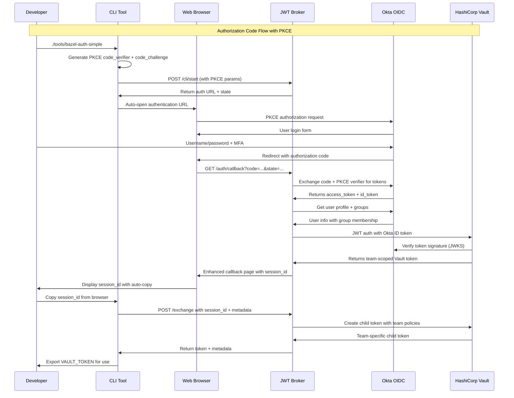

# 🏗️ System Architecture

This document describes the system architecture of the Enterprise OIDC Vault Demo, detailing how Okta, the broker service, and HashiCorp Vault work together to provide secure, team-based secret management.

## 📋 Table of Contents

- [Overview](#overview)
- [Component Architecture](#component-architecture)
- [Authentication Flow](#authentication-flow)
- [Team-Based Access Model](#team-based-access-model)
- [Data Flow Diagrams](#data-flow-diagrams)
- [Security Architecture](#security-architecture)
- [Deployment Architecture](#deployment-architecture)

## 🎯 Overview

The system implements an enterprise-grade authentication architecture using:

- **Okta OIDC**: Enterprise identity provider with Authorization Code Flow + PKCE
- **JWT Broker**: Intermediary service for PKCE token exchange and session management
- **HashiCorp Vault**: Secret management with JWT auth method and team-based policies
- **CLI Tools**: Zero-dependency authentication tools for developer workflows
- **Docker Compose**: Containerized deployment with network isolation

### Key Architectural Principles

1. **Zero Trust Security**: PKCE flow prevents code interception attacks
2. **Enterprise Integration**: Leverages existing Okta identity infrastructure
3. **Team-Based Authorization**: Automatic access control via Okta groups → Vault roles
4. **Developer Experience**: Enhanced callback UI with auto-copy functionality
5. **CLI-First Design**: Zero-dependency tools for command-line workflows
6. **Audit Transparency**: Complete audit trail with real user identity
7. **Scalable Design**: Supports growing teams and environments

## 🏢 Component Architecture

```
┌─────────────────────────────────────────────────────────────────┐
│                        Enterprise Network                        │
├─────────────────────────────────────────────────────────────────┤
│                                                                 │
│  ┌──────────────┐    ┌──────────────┐    ┌──────────────┐     │
│  │              │    │              │    │              │     │
│  │     Okta     │    │ JWT Broker   │    │ HashiCorp    │     │
│  │   Identity   │◄──►│   Service    │◄──►│    Vault     │     │
│  │   Provider   │    │              │    │              │     │
│  │              │    │              │    │              │     │
│  └──────────────┘    └──────────────┘    └──────────────┘     │
│                                                                 │
│  ┌─────────────────────────────────────────────────────────┐   │
│  │                Development Teams                        │   │
│  ├─────────────┬─────────────┬─────────────┬─────────────┤   │
│  │   Mobile    │   Backend   │  Frontend   │   DevOps    │   │
│  │ Developers  │ Developers  │ Developers  │    Team     │   │
│  └─────────────┴─────────────┴─────────────┴─────────────┘   │
│                                                                 │
└─────────────────────────────────────────────────────────────────┘
```

### Component Responsibilities

#### Okta Identity Provider
- **User Authentication**: Primary authentication for all users
- **Group Management**: Team membership via Okta groups
- **OIDC Protocol**: Standards-compliant OpenID Connect implementation
- **Session Management**: Enterprise SSO and session controls

#### JWT Broker Service
- **Session Management**: Web-based authentication interface
- **Token Exchange**: OIDC token → Vault token conversion
- **Team Resolution**: Maps Okta groups to Vault entities
- **Child Token Creation**: Generates team-scoped Vault tokens

#### HashiCorp Vault
- **Secret Storage**: Encrypted secret management
- **OIDC Authentication**: Native OIDC auth method integration
- **Policy Engine**: Team-based access control policies
- **Identity Management**: Entity and group management

## 🔐 Authentication Flow

### PKCE Authentication Sequence (CLI + Browser)



### Session Management

The broker maintains secure sessions with:
- **PKCE Security**: Code verifier prevents code interception
- **Session Storage**: In-memory session management with expiration
- **State Validation**: CSRF protection via secure state parameters
- **Auto-Expiration**: Sessions expire with token TTL
- **Team Context**: Session stores team membership

## 👥 Team-Based Access Model

### Team Identity Mapping

```
Okta Groups                  Vault Entities              Secret Paths
─────────────────────────────────────────────────────────────────────
mobile-developers     →     entity_mobile_team     →    kv/dev/mobile/*
backend-developers    →     entity_backend_team    →    kv/dev/backend/*
frontend-developers   →     entity_frontend_team   →    kv/dev/frontend/*
devops-team          →     entity_devops_team     →    kv/dev/*
```

### Policy Resolution

## 🛠️ CLI Tools Architecture

### Tool Ecosystem

```
┌─────────────────────────────────────────────────────────────┐
│                    Developer Workflow                       │
├─────────────────────────────────────────────────────────────┤
│                                                             │
│  ┌──────────────────┐    ┌──────────────────┐              │
│  │ bazel-auth-simple│    │   bazel-build    │              │
│  │ (Zero deps)      │    │ (Bazel wrapper)  │              │
│  │ - curl only      │    │ - Auto auth      │              │
│  │ - PKCE flow      │    │ - Token reuse    │              │
│  │ - Auto browser   │    │ - Metadata       │              │
│  └──────────────────┘    └──────────────────┘              │
│           │                        │                       │
│           └────────┬───────────────┘                       │
│                    │                                       │
│         ┌──────────▼──────────┐                           │
│         │   Enhanced Broker   │                           │
│         │   - PKCE security   │                           │
│         │   - Session mgmt    │                           │
│         │   - Auto-copy UI    │                           │
│         └─────────────────────┘                           │
└─────────────────────────────────────────────────────────────┘
```

### CLI Tool Capabilities

| Tool | Dependencies | Use Case | Output |
|------|-------------|----------|---------|
| `bazel-auth-simple` | curl only | Primary CLI auth | Token export |
| `bazel-auth` | Python + requests | Advanced features | Rich output |
| `bazel-build` | bash + curl | Seamless builds | Bazel integration |

### Enhanced Developer Experience

1. **Auto-Browser Opening**: Tools automatically open authentication URLs
2. **Enhanced Callback UI**: Beautiful web interface with copy buttons  
3. **Session ID Management**: Clear session exchange workflow
4. **Environment Integration**: Direct export to shell environment
5. **Pipeline Metadata**: Automatic inclusion of build context

## 👥 Team-Based Access Model

Teams are automatically assigned based on Okta group membership:

### Group → Role → Policy Mapping

1. **User Authentication**: User authenticates via Okta OIDC with PKCE
2. **Group Resolution**: Okta returns user's group memberships
3. **Role Assignment**: Vault JWT auth method maps groups to roles
4. **Policy Application**: Team-specific policies applied to tokens
5. **Secret Access**: User can access team-scoped secrets only

### Team Isolation

Teams are completely isolated through:
- **Separate Roles**: Each team has dedicated Vault JWT role
- **Scoped Policies**: Policies only allow access to team paths
- **Group-Based Assignment**: Automatic team assignment via Okta groups
- **Audit Separation**: Team activities logged with user identity

## 📊 Data Flow Diagrams

### Token Exchange Flow

```
┌─────────────┐    OIDC Redirect     ┌─────────────┐
│   Browser   │◄────────────────────►│    Okta     │
└─────────────┘                      └─────────────┘
       │                                     │
       │ Authorization Code                  │ User Info
       ▼                                     ▼
┌─────────────┐    Token Exchange    ┌─────────────┐
│ JWT Broker  │◄────────────────────►│    Vault    │
└─────────────┘                      └─────────────┘
       │                                     │
       │ Team-Scoped Token                   │ Secret Access
       ▼                                     ▼
┌─────────────┐                      ┌─────────────┐
│   Session   │                      │   Secrets   │
│   Storage   │                      │   Storage   │
└─────────────┘                      └─────────────┘
```

### Secret Access Pattern

```
User Request
     │
     ▼
┌─────────────────┐
│ Authentication  │
│   Validation    │
└─────────────────┘
     │
     ▼
┌─────────────────┐
│ Team Membership │
│   Resolution    │
└─────────────────┘
     │
     ▼
┌─────────────────┐
│ Policy Engine   │
│   Evaluation    │
└─────────────────┘
     │
     ▼
┌─────────────────┐
│ Secret Access   │
│   Authorization │
└─────────────────┘
```

## 🛡️ Security Architecture

### Defense in Depth

```
┌─────────────────────────────────────────────────────────┐
│                  Security Layers                        │
├─────────────────────────────────────────────────────────┤
│ 🌐 Network Security                                     │
│   • TLS encryption for all communication               │
│   • Docker network isolation                           │
│   • Firewall rules and network policies                │
├─────────────────────────────────────────────────────────┤
│ 🔐 Authentication Security                              │
│   • Enterprise Okta MFA                                │
│   • OIDC protocol compliance                           │
│   • Short-lived token lifecycle                        │
├─────────────────────────────────────────────────────────┤
│ 👥 Authorization Security                               │
│   • Team-based access control                          │
│   • Principle of least privilege                       │
│   • Dynamic policy evaluation                          │
├─────────────────────────────────────────────────────────┤
│ 📝 Audit & Compliance                                   │
│   • Complete audit trail                               │
│   • Immutable log storage                              │
│   • Real-time monitoring                               │
└─────────────────────────────────────────────────────────┘
```

### Security Controls

#### Authentication Controls
- **Multi-Factor Authentication**: Enforced via Okta
- **Session Management**: Secure session tokens with CSRF protection
- **Token Lifecycle**: Short-lived tokens with automatic renewal
- **Identity Verification**: Real user identity in audit logs

#### Authorization Controls
- **Team-Based Access**: Automatic access control via group membership
- **Least Privilege**: Users only access their team's secrets
- **Dynamic Policies**: Policies evaluated at access time
- **Entity Isolation**: Complete separation between team entities

#### Operational Controls
- **Audit Logging**: All access attempts logged immutably
- **Monitoring**: Real-time alerting on unusual patterns
- **Compliance**: Standards-compliant OIDC implementation
- **Key Management**: Secure key storage and rotation

## 🚀 Deployment Architecture

### Development Environment

```yaml
version: '3.8'
services:
  broker:
    build: .
    ports:
      - "8081:8081"
    environment:
      - OKTA_DOMAIN=${OKTA_DOMAIN}
      - OKTA_CLIENT_ID=${OKTA_CLIENT_ID}
      - OKTA_CLIENT_SECRET=${OKTA_CLIENT_SECRET}
      - VAULT_ADDR=http://vault:8200
    networks:
      - vault-network

  vault:
    image: vault:latest
    ports:
      - "8200:8200"
    environment:
      - VAULT_DEV_ROOT_TOKEN_ID=${VAULT_ROOT_TOKEN}
    networks:
      - vault-network

networks:
  vault-network:
    driver: bridge
```

### Production Considerations

#### High Availability
- **Load Balancer**: Multiple broker instances behind load balancer
- **Vault Enterprise**: High availability Vault cluster
- **Database Backend**: Persistent storage for Vault data
- **Session Storage**: Distributed session storage (Redis/Hazelcast)

#### Scaling
- **Horizontal Scaling**: Multiple broker instances
- **Auto-Scaling**: Container orchestration (Kubernetes)
- **Caching**: Distributed caching for performance
- **Monitoring**: Comprehensive monitoring and alerting

#### Security Hardening
- **TLS Everywhere**: Full encryption in transit
- **Network Policies**: Micro-segmentation
- **Key Management**: Enterprise key management (HSM)
- **Compliance**: SOC2, FedRAMP compliance features

## 📈 Performance Characteristics

### Throughput
- **Authentication Rate**: 100+ authentications/second
- **Token Exchange**: Sub-second token exchange
- **Secret Access**: Millisecond secret retrieval
- **Session Management**: 1000+ concurrent sessions

### Scalability
- **Team Growth**: Linear scaling with team count
- **User Growth**: Efficient entity reuse per team
- **Secret Growth**: Vault handles millions of secrets
- **Geographic Distribution**: Multi-region deployment support

### Availability
- **Target SLA**: 99.9% uptime
- **Recovery Time**: < 5 minutes
- **Backup Strategy**: Regular Vault snapshots
- **Disaster Recovery**: Cross-region replication

## 🔧 Integration Points

### External Systems
- **CI/CD Pipelines**: Jenkins, GitHub Actions, Azure DevOps
- **Monitoring**: Prometheus, Grafana, DataDog
- **Logging**: ELK Stack, Splunk
- **Alerting**: PagerDuty, Slack notifications

### API Interfaces
- **REST APIs**: Standard HTTP REST interfaces
- **Webhook Support**: Event-driven integrations
- **GraphQL**: Rich query interface for complex operations
- **gRPC**: High-performance internal communication

## 📚 References

- [Okta OIDC Documentation](https://developer.okta.com/docs/concepts/oauth-openid/)
- [HashiCorp Vault OIDC Auth](https://www.vaultproject.io/docs/auth/jwt)
- [OpenID Connect Specification](https://openid.net/connect/)
- [JWT Best Practices](https://tools.ietf.org/html/rfc8725)